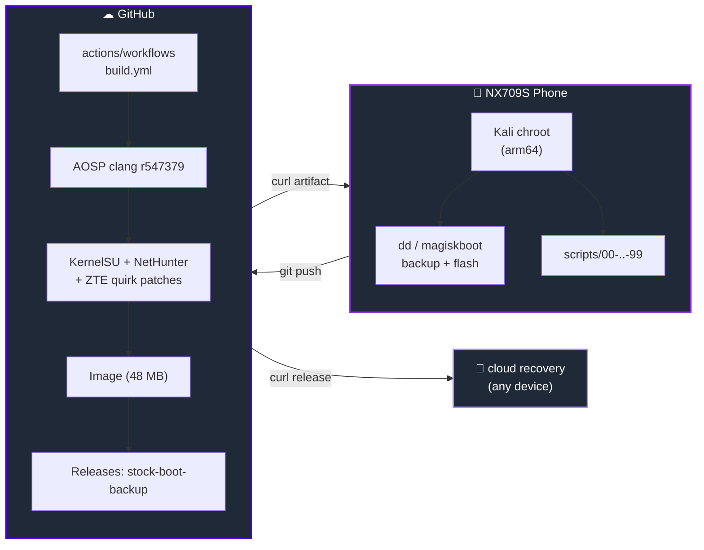
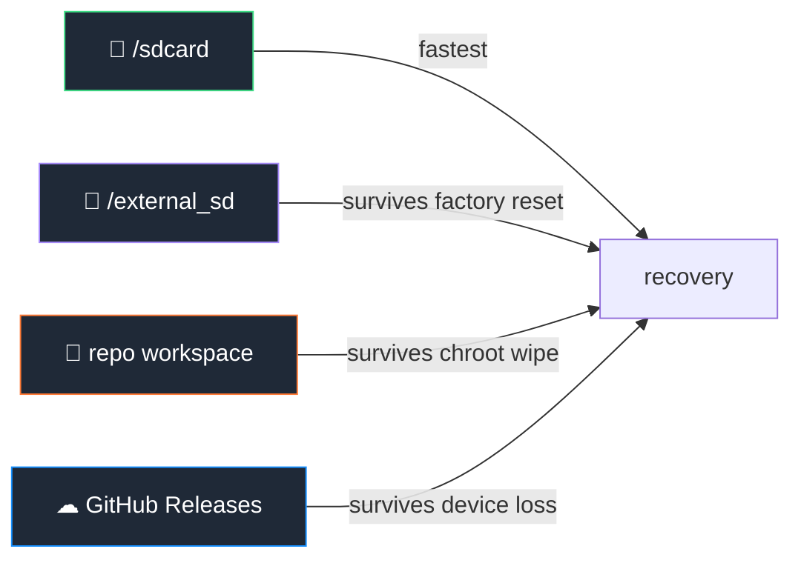

<!-- ============================================================
     N U B I A   N X 7 0 9 S   ·   custom kernel forge
     animated · modern · full tutorial · made by piash, BD
     ============================================================ -->

<a name="top"></a>

<!-- ░░░░░ ANIMATED BANNER ░░░░░ -->
<p align="center">
  <a href="https://github.com/piashmsu/nubia-nx709s-kernel">
    
  </a>
</p>

<!-- ░░░░░ TYPING ░░░░░ -->
<p align="center">
  <a href="https://github.com/piashmsu">
    
  </a>
</p>

<!-- ░░░░░ BADGES ░░░░░ -->
<p align="center">
  <a href="https://github.com/piashmsu/nubia-nx709s-kernel/actions/workflows/build.yml">
    
  </a>
  <a href="https://github.com/piashmsu/nubia-nx709s-kernel/releases">
    
  </a>
  <a href="https://github.com/piashmsu/nubia-nx709s-kernel/stargazers">
    
  </a>
  <a href="LICENSE">
    
  </a>
  
  
  
  
</p>

<!-- ░░░░░ TECH STACK PILLS ░░░░░ -->
<p align="center">
  
</p>

<p align="center">
  <a href="#-tutorial">📘 Tutorial</a> ·
  <a href="#-architecture">🏗 Architecture</a> ·
  <a href="#-build">⚙ Build</a> ·
  <a href="#-flash">🚀 Flash</a> ·
  <a href="#-recovery">🛟 Recovery</a> ·
  <a href="#-author">👤 Piash</a>
</p>

<br/>

<!-- ░░░░░ HERO STAT GRID ░░░░░ -->
<div align="center">
<table>
<tr>
  <td align="center" width="20%"><br/><b>SoC</b><br/><sub>SM8475<br/>Cape · 8+ Gen 1</sub></td>
  <td align="center" width="20%"><br/><b>Kernel</b><br/><sub>5.10.168 GKI<br/>android12-9</sub></td>
  <td align="center" width="20%"><br/><b>OS</b><br/><sub>Android 12<br/>NubiaUI 5.0</sub></td>
  <td align="center" width="20%"><br/><b>ABI</b><br/><sub>arm64-v8a<br/>ab9937098</sub></td>
  <td align="center" width="20%"><br/><b>Forge</b><br/><sub>Kali chroot<br/>+ GitHub CI</sub></td>
</tr>
</table>
</div>

<br/>

---

## 🎯  what is this?

A **fully reproducible** custom-kernel pipeline for the **Nubia Red Magic 7S Pro (NX709S)**.
The whole thing was built **from a Kali Linux chroot running on the phone itself** — no desktop, no cable. Hardened with NetHunter, rooted with KernelSU, verified by SHA256 at every step, and snapshotted to GitHub Releases so the device can be revived from anywhere with internet.

> ✨ One command in CI ⇒ a flashable kernel.
> ✨ One script on the phone ⇒ a reversible flash.
> ✨ One URL ⇒ a full cloud recovery.

<br/>

---

## 🏗  architecture



<br/>

---

## 📘  tutorial

> Everything below is **copy-pasteable**. The scripts are numbered so you run them in order.

### 0 · prerequisites

<table>
<tr><td>

| You need | Where |
|---|---|
| Rooted Android (Magisk) | the phone |
| Linux chroot with `dd`, `curl`, `git`, `python3` | the phone (Kali, Termux + proot, etc.) |
| Bootloader unlocked | one-time on the phone |
| GitHub account + PAT | for CI builds |

</td><td>

```bash
apt update && apt install -y \
  git curl wget python3 \
  zstd unzip file \
  abootimg cpio
```

</td></tr>
</table>

<br/>

### 1 · clone the forge

```bash
git clone https://github.com/piashmsu/nubia-nx709s-kernel.git
cd nubia-nx709s-kernel
```

<br/>

### 2 · capture *your* device fingerprint (don't skip!)

```bash
bash scripts/00-collect-device-info.sh
```

This dumps `/proc/config.gz`, `/proc/cmdline`, `getprop`, and the partition map into `device-info/`. **If your phone is not an NX709S, stop here** — these images are device-specific.

<br/>

### 3 · backup every boot-related partition (3 redundant copies)

```bash
bash scripts/01-backup-bootimg.sh
```

Outputs to:
1. `/sdcard/nubia_boot_backup_<timestamp>/`
2. `/external_sd/nubia_backup_<timestamp>/` (if microSD present)
3. `boot_image/backup_<date>/` in the repo (gitignored)

> 💾 `boot_a · boot_b · dtbo_a · dtbo_b · vendor_boot_a · vendor_boot_b · vbmeta_* · recovery_*` — 12 partitions, ~634 MB. Each verified with SHA256.

<br/>

### 4 · trigger the CI build (3 ways)

<details><summary><b>① web UI (easiest)</b></summary>

Open `Actions → build → Run workflow → main → Run`.
Wait ~35 minutes. Download `kernel-Image` from the artifacts.

</details>

<details><summary><b>② curl (no browser)</b></summary>

```bash
curl -X POST \
  -H "Authorization: Bearer $GITHUB_PAT" \
  -H "Accept: application/vnd.github+json" \
  https://api.github.com/repos/piashmsu/nubia-nx709s-kernel/actions/workflows/build.yml/dispatches \
  -d '{"ref":"main","inputs":{"kernelsu":"true","nethunter":"true"}}'
```

</details>

<details><summary><b>③ local build (only if you have 16 GB RAM)</b></summary>

```bash
bash scripts/02-fetch-toolchain.sh
bash scripts/04-apply-kernelsu.sh
bash scripts/05-apply-nethunter.sh
bash scripts/04b-fix-zte-quirks.sh
bash scripts/06-build-kernel.sh
```

</details>

<br/>

### 5 · download the built `Image`

```bash
RUN_ID=$(gh run list -w build.yml -L 1 --json databaseId -q '.[0].databaseId')
gh run download $RUN_ID -n kernel-Image -D /tmp/finalimg
ls -la /tmp/finalimg/dist/Image           # ~48 MB
```

<br/>

### 6 · repack with stock ramdisk

```bash
bash scripts/07-pack-bootimg.sh /tmp/finalimg/dist/Image
# uses magiskboot to:
#   - unpack stock boot_a.img (kernel + ramdisk + cmdline)
#   - swap kernel for the CI build
#   - repack into work/new-boot.img
#   - SHA256 round-trip verify
```

<br/>

### 7 · 🚀 flash

> ⚠ **point of no return** — make sure step 3 succeeded.

```bash
# active slot detection (auto-pick the inactive one if available)
ACTIVE=$(grep -oP 'androidboot.slot_suffix=_\K[ab]' /proc/cmdline 2>/dev/null || echo a)
TARGET=$([ "$ACTIVE" = a ] && echo b || echo a)
echo "active=$ACTIVE  target=$TARGET"

dd if=work/new-boot.img \
   of=/dev/block/by-name/boot_$TARGET \
   bs=1M conv=fsync
sync

# verify
diff <(sha256sum < work/new-boot.img) \
     <(sha256sum < /dev/block/by-name/boot_$TARGET)
```

If you can't switch slots from chroot, flash the **active** slot — slot B keeps the stock kernel as a guaranteed fallback (Android's A/B will auto-rollback after 3 failed boots).

<br/>

### 8 · reboot & verify

```bash
reboot
# wait 60–90 s, then on the booted phone:
uname -a
ls /data/adb/ksu      # KernelSU live?
zcat /proc/config.gz | grep -E 'KSU|NETHUNTER'
```

<br/>

---

## ⚙  build pipeline

```mermaid
gantt
  title  CI build timeline (free-tier runner, 4 vCPU)
  dateFormat  X
  axisFormat  %M:%S

  section setup
  free disk + 8 GB swap     : a1, 0,    140
  install deps              : a2, 140,  170
  clone ZTE source 1.5 GB   : a3, 170,  186

  section toolchain
  AOSP clang r547379        : b1, 186,  761

  section patches
  KernelSU integration      : c1, 761,  766
  NetHunter defconfig       : c2, 766,  771
  ZTE quirks (IS_BUILTIN)   : c3, 771,  772

  section build
  make Image (j=2 + ccache) : d1, 772,  2100

  section publish
  upload artifacts          : e1, 2100, 2105
```



<br/>

---

## 🚀  flash

| Stage | Tool | What happens |
|---|---|---|
| 1 | `magiskboot unpack` | open stock `boot_a.img` (v4 GKI) |
| 2 | `cp Image kernel` | replace kernel binary |
| 3 | `magiskboot repack` | rebuild as `new-boot.img` |
| 4 | `dd ... bs=1M conv=fsync` | direct UFS block write |
| 5 | `sha256sum` round-trip | confirm bytes on flash match source |

<br/>

---

## 🛟  recovery

There are **4 redundant backup tiers**:



### one-shot cloud restore

```bash
curl -fsSL https://raw.githubusercontent.com/piashmsu/nubia-nx709s-kernel/main/scripts/98-download-backup-from-release.sh | bash
# downloads ~85 MB, SHA256-verified, zstd-decompressed in ./restored/
```

### live restore from chroot (interactive)

```bash
bash scripts/99-restore-bootimg.sh        # pick fastboot / dd / dry-run
```

<details><summary>📂 release contents (click to expand)</summary>

| File | Compressed | Raw |
|---|---|---|
| `boot_{a,b}.img.zst` | 17 MB ea | 96 MB ea |
| `vendor_boot_{a,b}.img.zst` | 7 MB ea | 96 MB ea |
| `dtbo_{a,b}.img.zst` | 326 KB ea | 24 MB ea |
| `recovery_{a,b}.img.zst` | 10 MB ea | 100 MB ea |
| `vbmeta_{,system_}{a,b}.img.zst` | <5 KB ea | 64 KB ea |
| `new-boot.img.zst` | 18 MB | 96 MB |
| **Total** | **85 MB** | **729 MB** |

zstd `-19` → 88 % saving · all <100 MB · GitHub Releases hosts forever

</details>

<br/>

---

## 🗂  repo layout

```
nubia-nx709s-kernel/
├─ .github/workflows/build.yml      ← CI: clang → KernelSU → NetHunter → quirks → make
├─ scripts/
│  ├─ 00-collect-device-info.sh     ← read /proc, dump partitions
│  ├─ 01-install-deps.sh            ← apt build deps
│  ├─ 02-fetch-toolchain.sh         ← AOSP clang + mkbootimg
│  ├─ 03-extract-bootimg.sh         ← magiskboot unpack
│  ├─ 04-apply-kernelsu.sh          ← KernelSU setup.sh
│  ├─ 04b-fix-zte-quirks.sh         ← IS_BUILTIN guards on fork.c/binder.c
│  ├─ 05-apply-nethunter.sh         ← NetHunter defconfig + RTL8812AU
│  ├─ 06-build-kernel.sh            ← make Image (replicates merge_nubia_diffconfig)
│  ├─ 07-pack-bootimg.sh            ← magiskboot repack
│  ├─ 98-download-backup-from-release.sh   ← cloud recovery
│  └─ 99-restore-bootimg.sh         ← interactive restore (fastboot/dd/dry-run)
├─ configs/                         ← gki_defconfig, NX709S diffs, running_kernel.config
├─ device-info/                     ← /proc/cmdline, build.prop, partitions, dtb dumps
├─ docs/
│  ├─ DEVICE_INFO.md
│  ├─ BUILD_GUIDE.md
│  ├─ COPILOT_PROMPT.md
│  └─ RECOVERY_GUIDE.md
└─ patches/                         ← unified-diff fallbacks
```

<br/>

---

## 🧠  what makes this different

<div align="center">
<table>
<tr>
  <td align="center" width="25%">🪞<br/><b>chroot-native</b><br/><sub>built without ever leaving<br/>the phone</sub></td>
  <td align="center" width="25%">🔁<br/><b>reproducible</b><br/><sub>every byte hashed,<br/>nothing manual</sub></td>
  <td align="center" width="25%">☁<br/><b>cloud-restorable</b><br/><sub>full recovery from<br/>a single curl</sub></td>
  <td align="center" width="25%">🩹<br/><b>self-healing CI</b><br/><sub>4 fixes documented in<br/>commit history</sub></td>
</tr>
</table>
</div>

<br/>

---

## 🧪  results

| Metric | Value |
|---|---|
| Kernel `Image` | 48 MB · arm64 · 4K pages |
| Build time | ≈ 22 min on a 4-vCPU runner |
| `Image` SHA256 | `80a13d06d7febcf2d045184ab2d09d2e0e02acf9e4e6f1caefae798b8d36de2c` |
| `new-boot.img` SHA256 | `85df47383040fb81fb94b7b3b606c45c056ec332581dcec8c8761eca657625da` |
| Compression ratio | 729 MB → 85 MB (88 % saving · zstd -19) |
| Partitions backed up | 12 |
| Restore paths | 4 (sdcard / SD / repo / cloud) |
| First-try CI success | ❌ (4 fixes, all in commit log) |
| Final-build CI success | ✅ |

<br/>

---

## 👤  author

<div align="center">
<a href="https://github.com/piashmsu">
  
  
</a>
</div>

<br/>

<div align="center">
<table>
<tr>
<td align="center" width="220">
<a href="https://github.com/piashmsu">
  
</a>
</td>
<td>

### Piash · MSU

> Forging custom firmware on the device that runs it.
> Reverse-engineering Android internals from a chroot — because who needs a desktop.

📍 **Bangladesh** 🇧🇩
🐙 **github.com/piashmsu**
🔧 stack: Linux · ARM64 · Android Internals · CI/CD · GPL kernels
☕ powered by tea, midnight, and `dmesg | grep -i error`

</td>
</tr>
</table>
</div>

<br/>

<div align="center">
  
</div>

<br/>

---

## 🤝  contributing

```bash
# 1. fork it
gh repo fork piashmsu/nubia-nx709s-kernel --clone

# 2. branch it
git checkout -b feat/your-cool-thing

# 3. push it
git commit -m "feat: …" && git push origin feat/your-cool-thing

# 4. PR it
gh pr create --fill
```

PRs that add **other Nubia / RedMagic devices** are especially welcome — keep the script numbering and the `device-info/` capture pattern.

<br/>

---

## ⚠  legal & safety

* Kernel source: **GPL v2** (ZTE GPL drop, see `LICENSE`)
* Boot image binaries in releases: **device-specific signed blobs** — only flash on a real NX709S
* Bootloader **must be unlocked** before flashing — *will void warranty in some regions*
* You are responsible for your device. The author has tested only one specific NX709S unit.

> If you brick something, the [recovery guide](docs/RECOVERY_GUIDE.md) has 4 escape routes including EDL — read it before flashing, not after.

<br/>

---

<!-- ░░░░░ ANIMATED FOOTER ░░░░░ -->
<p align="center">
  
</p>

<p align="center">
  <a href="#top">⬆ back to top</a>
  <br/>
  <sub>made with care · in Bangladesh · by <a href="https://github.com/piashmsu"><b>Piash</b></a></sub>
</p>

<p align="center">
  
</p>
