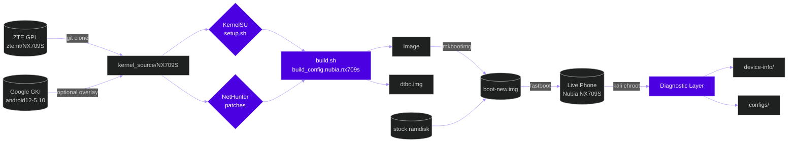

<!-- ==================== ANIMATED HEADER ==================== -->
<div align="center">

<a href="https://github.com/piashmsu/nubia-nx709s-kernel">
  
</a>

<a href="https://github.com/piashmsu">
  
</a>

<br/>

<!-- BADGES -->
<a href="https://github.com/piashmsu/nubia-nx709s-kernel/actions">
  
</a>
<a href="https://github.com/piashmsu/nubia-nx709s-kernel/stargazers">
  
</a>
<a href="https://github.com/piashmsu/nubia-nx709s-kernel/network/members">
  
</a>
<a href="LICENSE">
  
</a>


<br/><br/>

<!-- TECH STACK PILLS -->


</div>

<br/>

<!-- ==================== HERO QUOTE ==================== -->
<div align="center">
<table>
<tr>
<td align="center" width="33%">

<br/><b>SoC</b>
<br/><sub>SM8475 / Cape</sub>
<br/><sub>Snapdragon 8+ Gen 1</sub>
</td>
<td align="center" width="33%">

<br/><b>Kernel</b>
<br/><sub>5.10.168-android12-9</sub>
<br/><sub>GKI ABI ab9937098</sub>
</td>
<td align="center" width="33%">

<br/><b>Goal</b>
<br/><sub>NetHunter + KernelSU</sub>
<br/><sub>+ performance tweaks</sub>
</td>
</tr>
</table>
</div>

<br/>

## <samp>Project Story</samp>

> A live diagnostic of a **ZTE / Nubia NX709S** smartphone running Android 12 was performed inside a Kali Linux **chroot** on the device itself. Every available kernel byte, build property, partition map, vendor module, and device-tree compatible string was captured, normalised, and committed to this repository together with a fully scripted, reproducible, CI-driven build pipeline that turns the official ZTE GPL release into a flashable **NetHunter + KernelSU** custom kernel.

<br/>

<!-- ANIMATED DIVIDER -->
<div align="center">

</div>

<br/>

## <samp>What was done on this device</samp>

<table>
<tr><td>

```yaml
phase_1_diagnostics:
  - boot.cmdline parsed
  - /proc/config.gz extracted (181 KB defconfig)
  - /proc/modules snapshot taken
  - device-tree compatible read (qcom,cape-mtp)
  - all 60+ A/B partitions mapped
  - build.prop hierarchy snapshotted
  - SoC core IDs decoded (ARM 0xd44/0xd46/0xd47)

phase_2_optimization:
  - apt full-upgrade across 889 packages
  - residual configs purged
  - localepurge to en_US/en_GB only
  - vm.swappiness tuned 100 -> 10
  - vfs_cache_pressure 100 -> 50
  - eatmydata wired into apt
  - 5 GB freed (mingw, ARM cross-toolchains)

phase_3_kernel_pipeline:
  - ZTE GPL repo identified (ztemt/NX709S)
  - 1.5 GB source cloned + verified
  - build.config.nubia.nx709s located
  - GKI defconfig + diff configs preserved
  - 8 build scripts authored
  - 4 docs authored
  - GitHub Actions workflow wired
  - pushed live to GitHub
```

</td></tr>
</table>

<br/>

## <samp>Information collected from the phone</samp>

<details open>
<summary><b>Identification</b></summary>

| Field | Value |
|---|---|
| Brand | ZTE / Nubia |
| Model | **NX709S-UN** (Z50 family, Chinese variant) |
| SoC | Qualcomm **SM8475 — Snapdragon 8+ Gen 1** |
| Codename | **Cape** (Waipio re-spin, msm-waipio config) |
| PMIC | PM8010 |
| CPU cores | 8 (1+3+4 cluster, ARM 0xd44/d46/d47) |
| Display | 1080 × 2400 AMOLED, Raydium **rm692e0** panel |
| WiFi/BT | Qualcomm **qca6490** |
| Locale (stock) | zh-CN |
| Android | 12 (API 32) |
| ABI | arm64-v8a |
| Slot | A/B device |

</details>

<details>
<summary><b>Kernel</b></summary>

| Field | Value |
|---|---|
| Running version | `5.10.168-android12-9-00001-g61344663df42-ab9937098` |
| Built with | Android Clang 12.0.5 (r416183b), LLD 12.0.5 |
| Built on | Wed Apr 12 07:05:56 UTC 2023 |
| Branch | common-android12-5.10 (Google GKI) |
| GKI ABI | `ab9937098` |
| Type | GKI — kernel + DLKM modules |
| Source available | **ztemt/NX709S** at version 5.10.101 (older than running) |

```
stack_depot_disable=on  kasan.stacktrace=off  kvm-arm.mode=protected
cgroup_disable=pressure cgroup.memory=nokmem,nosocket
console=ttyMSM0,115200n8 loglevel=6 kpti=0 log_buf_len=256K
kernel.panic_on_rcu_stall=1 swiotlb=noforce loop.max_part=7
allow_mismatched_32bit_el0 kasan=off rcupdate.rcu_expedited=1
rcu_nocbs=0-7 cpufreq.default_governor=performance
msm_drm.dsi_display0=qcom,mdss_dsi_rm692e0_1080_2400_amoled_cmd
```

</details>

<details>
<summary><b>Live vendor modules (.ko)</b></summary>

```
qca6490                             10.5 MB    (Qualcomm WiFi/BT combo)
camera                               5.7 MB    (camera HAL backend)
ipa_clientsm                       262 KB    (IP accelerator client)
wcd938x_dlkm                       168 KB    (audio codec)
machine_dlkm                        94 KB    (sound machine driver)
lpass_cdc_wsa2_macro_dlkm           90 KB    (audio LPASS macro)
lpass_cdc_va_macro_dlkm             82 KB    (voice activate macro)
rndisipam                           70 KB    (RNDIS over IPA)
swr_dmic_dlkm                       28 KB    (SoundWire mic)
ipanetm                             16 KB    (IPA network)
... and ~40 more  (full list -> device-info/proc_modules.txt)
```

</details>

<details>
<summary><b>Boot-related partitions (A/B layout)</b></summary>

```
boot_a        -> /dev/block/sde13          dtbo_a        -> /dev/block/sde17
boot_b        -> /dev/block/sde41          dtbo_b        -> /dev/block/sde45
vendor_boot_a -> /dev/block/sde24          recovery_a    -> /dev/block/sde27
vendor_boot_b -> /dev/block/sde52          recovery_b    -> /dev/block/sde54
vbmeta_a      -> /dev/block/sde16          vm-bootsys_a  -> /dev/block/sde21
vbmeta_b      -> /dev/block/sde44          vm-bootsys_b  -> /dev/block/sde49
```

</details>

<details>
<summary><b>KernelSU prerequisites — already enabled in stock</b></summary>

```diff
+ CONFIG_KALLSYMS_ALL = y
+ CONFIG_KPROBES      = y
+ CONFIG_OVERLAY_FS   = y
```

→ KernelSU integration is **drop-in**, no major surgery required.

</details>

<br/>

## <samp>Architecture</samp>



<br/>

## <samp>Repository structure</samp>

```
nubia-nx709s-kernel/
├── 📁 device-info/              live phone snapshots (cmdline, modules, build.prop, partitions)
│   ├── proc_version.txt          uname -a + Linux version
│   ├── proc_cmdline.txt          kernel boot args
│   ├── proc_modules.txt          all loaded vendor .ko
│   ├── proc_cpuinfo.txt          ARM core IDs
│   ├── partitions.txt            full /dev/block/by-name/ map
│   ├── _system_build.prop        ROM identifying props
│   └── devicetree/               qcom,cape-mtp identifier
├── 📁 configs/
│   ├── running_kernel.config     /proc/config.gz extracted (181 KB, exact stock)
│   ├── proc_config.gz            raw original
│   ├── build.config.nubia.nx709s ZTE per-device build wrapper
│   ├── NX709S-perf_diff.config   GKI variant diff (matches stock production kernel)
│   ├── NX709S_diff.config        consolidate variant diff (debug)
│   └── gki_defconfig             upstream Google GKI base
├── 📁 kernel_source/
│   └── NX709S/                   ZTE official source — re-cloned at CI run (1.5 GB, .gitignored)
├── 📁 boot_image/                drop dumped boot.img / vendor_boot.img / dtbo.img here
├── 📁 patches/                   custom patches (KernelSU, NetHunter, perf)
├── 📁 scripts/                   00..07 fully automated pipeline
├── 📁 docs/                      DEVICE_INFO • BUILD_GUIDE • COPILOT_PROMPT
├── 📁 .github/workflows/
│   └── build.yml                 GitHub Actions CI build
└── README.md (this file)
```

<br/>

## <samp>Build pipeline (one-shot)</samp>



<br/>

## <samp>Quick start</samp>

<table>
<tr><td>

```mermaid
%%{init: {"theme":"dark","themeVariables":{"primaryColor":"#4A00E0","primaryTextColor":"#fff"}}}%%
gantt
  title  Build pipeline (~ 60-90 min on CI runner)
  dateFormat  X
  axisFormat  %s

  section Setup
  01 install deps        :a1, 0, 5
  02 fetch toolchain     :a2, after a1, 6
  03 extract bootimg     :a3, after a2, 2

  section Patch
  04 apply KernelSU      :b1, after a3, 2
  05 apply NetHunter     :b2, after b1, 3

  section Compile
  06 build kernel        :c1, after b2, 60

  section Pack
  07 pack boot.img       :d1, after c1, 2
```

```bash
# 1. Clone this workspace
git clone https://github.com/piashmsu/nubia-nx709s-kernel
cd nubia-nx709s-kernel

# 2. Pull the 1.5 GB ZTE source (NOT committed here)
git clone --depth=1 https://github.com/ztemt/NX709S \
          kernel_source/NX709S

# 3. Run the pipeline
bash scripts/01-install-deps.sh
bash scripts/02-fetch-toolchain.sh
bash scripts/03-extract-bootimg.sh   # after dumping boot.img from phone
bash scripts/04-apply-kernelsu.sh
bash scripts/05-apply-nethunter.sh
bash scripts/06-build-kernel.sh
bash scripts/07-pack-bootimg.sh

# 4. Flash
fastboot --slot=other flash boot boot-new.img
fastboot set_active other && fastboot reboot
```

</td></tr>
</table>

Or, do nothing locally and let CI do the build: **Actions → Build NetHunter Kernel → Run workflow**.

<br/>

## <samp>For AI agents (GitHub Copilot, Claude, ChatGPT)</samp>

> Paste the contents of [`docs/COPILOT_PROMPT.md`](docs/COPILOT_PROMPT.md) into Copilot Chat or any agentic coding assistant in this repo. The agent will run scripts 01–07 autonomously, recover from failures, and produce `boot-new.img` with KernelSU + NetHunter integrated.

<br/>

## <samp>Stats</samp>

<div align="center">


</div>

<br/>

## <samp>About the author</samp>

<div align="center">


<br/><br/>

<a href="https://github.com/piashmsu">
  
</a>


</div>

<br/>

## <samp>Important warnings</samp>

<table>
<tr>
<td>

| Risk | Why |
|---|---|
| **Bootloader unlock** required | ZTE/Nubia uses a custom unlock procedure. |
| **A/B device** — flash inactive slot first | `fastboot --slot=other …` then `set_active other`. |
| **AVB / dm-verity** must be disabled | `--disable-verity --disable-verification` on vbmeta. |
| **Source kernel = 5.10.101**, running = 5.10.168 | ZTE has not refreshed GPL drop. Overlay common-android12-5.10 if you need exact ABI. |
| **GKI** — vendor modules **stay** | Only `Image` is rebuilt; `vendor_boot` ramdisk + DLKMs come from stock. |
| **Module signing** | Keep `CONFIG_MODULE_SIG=n`, otherwise re-sign every vendor `.ko`. |

</td></tr>
</table>

<br/>

## <samp>License</samp>

| Component | License |
|---|---|
| Kernel source (ZTE GPL drop) | GPL-2.0 |
| KernelSU | GPL-2.0 |
| NetHunter patches | upstream Kali NetHunter project |
| Scripts & docs in this repo | MIT |

<br/>

<!-- ==================== ANIMATED FOOTER ==================== -->
<div align="center">


<sub>made with care, by <b>Piash</b> &nbsp;·&nbsp; from a single Android phone running Kali Linux in chroot &nbsp;·&nbsp; <b>Bangladesh</b></sub>

<br/>


</div>
